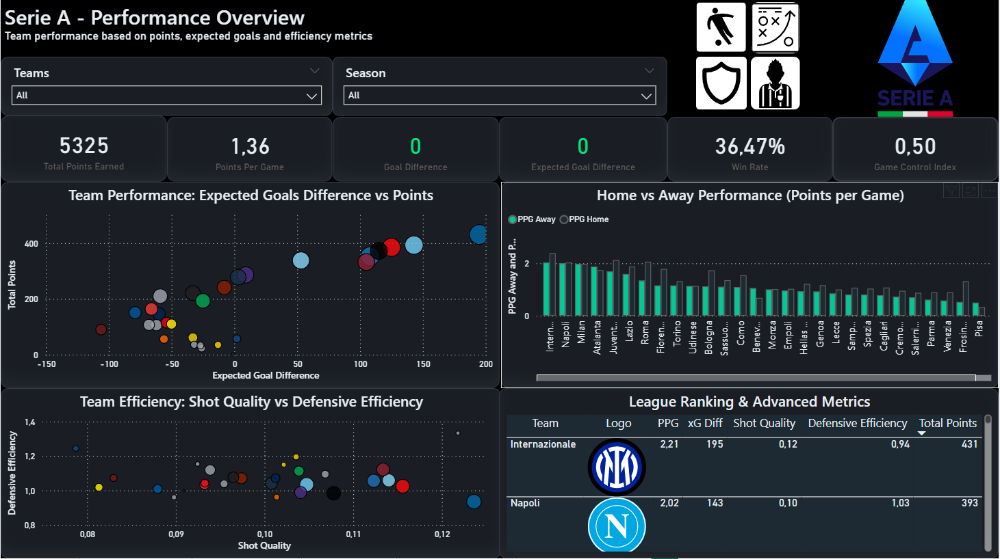
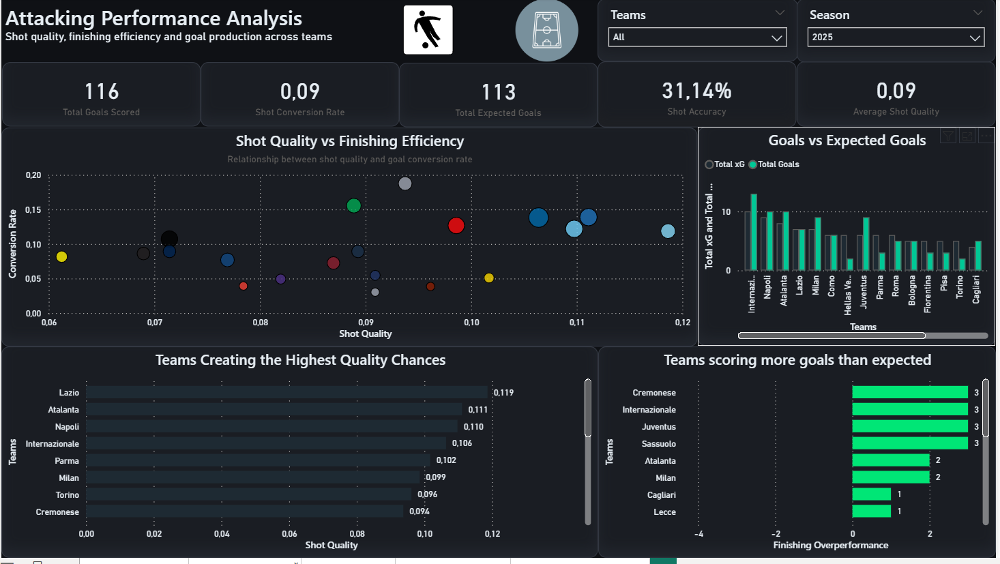
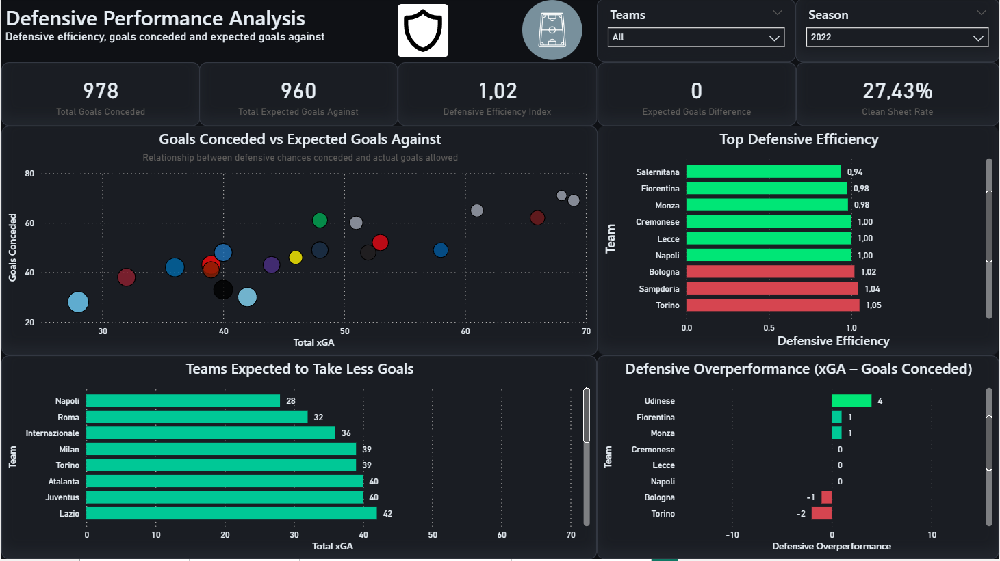
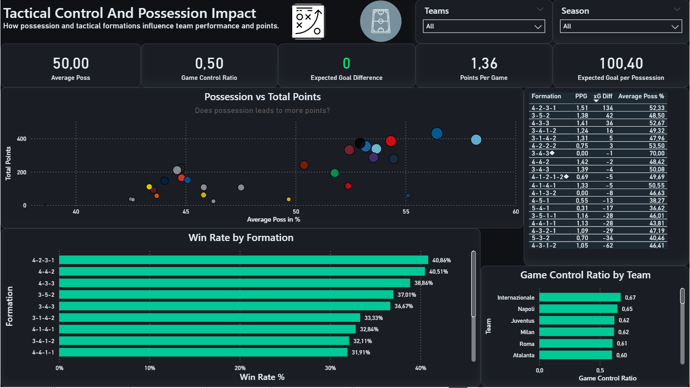
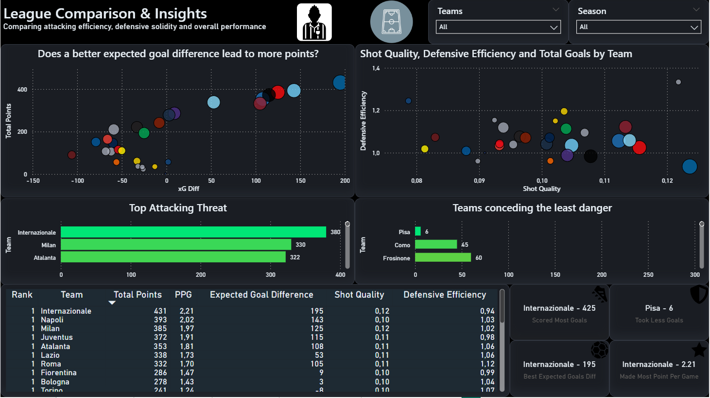

# Serie_A_Project
This repository was made to show off a project on Serie A in a period that went from 2020 to 2025

## Project Overview

This project is an end-to-end **data analysis and visualization** of football performance in Serie A, built using **Power BI Desktop**.

The goal is to explore team performance through **advanced football analytics metrics**, such as expected goals (xG), efficiency indicators, and tactical insights.

The dashboard provides a comprehensive view of:

* Attacking performance
* Defensive solidity
* Tactical behavior
* Overall team efficiency

---

## Objectives

* Analyze team performance beyond basic statistics (goals, points)
* Introduce **advanced metrics** like xG, xGA, and efficiency ratios
* Build a **professional, interactive dashboard**
* Apply best practices in **data modeling, DAX, and visualization**

---

## Tools & Technologies

* **Power BI Desktop**
* **Power Query** (data cleaning & transformation)
* **DAX (Data Analysis Expressions)** for calculated measures
* Data visualization best practices

---

## Dataset

The dataset contains match-level and team-level statistics, including:

* Goals scored and conceded
* Expected Goals (xG) and Expected Goals Against (xGA)
* Shots, shots on target
* Possession
* Points and match results

Data cleaning was required due to:

* Unrealistic values (e.g. incorrect scores)
* Inconsistent xG values
* Missing or noisy data

---

## Data Model & Calculations

### Key Metrics Created

* **xG Difference**

  * `xG Diff = xG - xGA`

* **Points Per Game (PPG)**

  * `PPG = Total Points / Matches`

* **Shot Quality**

  * `Shot Quality = xG / Shots`

* **Conversion Rate**

  * `Conversion Rate = Goals / Shots`

* **Shot Accuracy**

  * `Shot Accuracy = Shots on Target / Shots`

* **Defensive Efficiency**

  * `Defensive Efficiency = Goals Conceded / xGA`

* **Game Control Ratio**

  * Custom metric to evaluate control over matches

* **Finishing Overperformance**

  * `Goals - xG`

* **Defensive Overperformance**

  * `xGA - Goals Conceded`

---

## Dashboard Structure

### Executive Overview

* High-level KPIs (Points, PPG, xG Diff, Win Rate)
* Team comparison via scatter plots
* Overall performance summary

---

### Offensive Analysis

* Shot quality vs conversion rate
* xG vs goals comparison
* Top attacking teams
* Finishing overperformance

---

### Defensive Analysis

* xGA vs goals conceded
* Defensive efficiency ranking
* Defensive overperformance
* Teams conceding least danger

---

### Tactical & Game Control Analysis

* Possession vs performance
* Game control ratio by team
* Formation-based analysis
* Win rate by formation

---

### Team Performance Overview

* xG Difference vs Total Points
* Attack vs Defense comparison
* Top performing teams
* Dynamic KPI cards (Best Attack, Best Defense, etc.)

---

## Design Choices

* Dark theme for better readability
* Consistent font usage (modern dashboard style)
* Clear hierarchy of visuals
* Scatter plots used for relationship analysis

---

## Key Insights

* Teams with high xG difference tend to achieve higher points
* Some teams overperform their xG, indicating strong finishing
* Defensive efficiency varies significantly across teams
* Possession alone does not guarantee better results
* Tactical formations impact win rate and performance

---

## What I Learned

* Building a full Power BI project from raw data
* Creating meaningful KPIs using DAX
* Designing dashboards with a clear storytelling structure
* Applying football analytics concepts to real data

---

## Future Improvements

* Update data with 2025/2026 season
* Improve data quality and validation
* Enhance interactivity (drill-through, tooltips)

---

## 📊 Dashboard Preview

### Executive Overview

### Offensive Analysis

### Defensive Analysis

### Tactical Analysis

### Final Insights

---

## Author

Data Analyst (Junior) passionate about analytics 

---

## If you like this project

Feel free to star the repository and connect with me!
